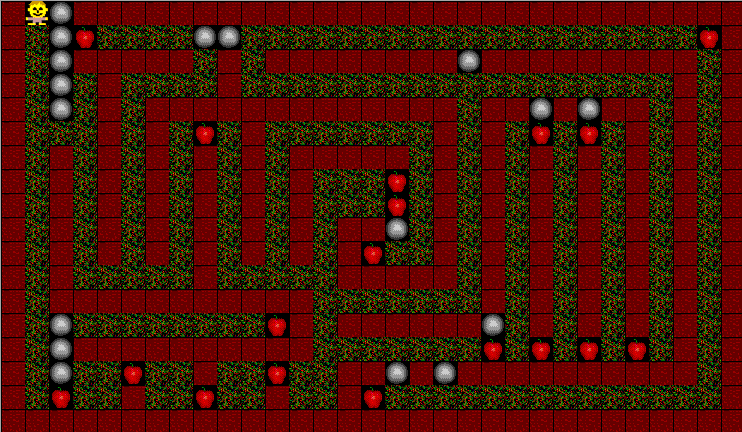

# Présentation

"Mr Matt" est un jeu de réflexion très simple : vous êtes M. Matt, creusant dans une grotte, mangeant des pommes (carottes, hamburgers, citrouilles) et évitant les chutes de pierres. Pas de tir, pas de meurtre - juste penser à l'avance et des heures de frustration sans fin...

Certains des niveaux sont assez simples pour être complétés par un enfant de six ans, d'autres nécessitent beaucoup de planification. Simple ne veut pas dire banal.

Le principe est très simple : pour un niveau donné, le joueur doit collecter l'ensemble des pommes (ou carottes, ou hamburgers, ou autres joyeusetées). La seule mécanique "réellement" complexe est la chute de rochers (ou pierres, etc.) qui est le seul élément pouvant vous tuer.

## Principe du jeu

Le jeu se comporte de 5 éléments affichables en plus du joueur :

- les pommes, objets à collecter ;
- l'herbe, case pleine qui arrête les mouvements des pierres et qui peut être creusée par le joueur ;
- les rochers, soumis à la gravité ;
- les cases vides, traversables par le joueur et les rochers ;
- les murs, infranchissables.

## Comportement des objets

Les éléments fixes (herbe, vide, pommes et murs) sont les objets les plus simples à réaliser : ils ne bougent pas et n'ont aucunement besoin d'avoir un comportement agissant sur le plateau de jeu.

Le seul comportement "intéressant" du jeu est celui, en dehors du joueur, des rochers.

Par principe, si un rocher se tient sur un objet, alors, il ne bouge pas. Prenons l'exemple d'un cas où un rocher (R) se tient sur de l'herbe (H).

|  	|  	|  	|  	|  	|  	|
|---	|---	|---	|---	|---	|---	|
|  	|  	| R 	|  	|  	|  	|
|  	|  	| H 	|  	|  	|  	|
|  	|  	|  	|  	|  	|  	|
|  	|  	|  	|  	|  	|  	|
|  	|  	|  	|  	|  	|  	|

Le joueur (noté J) peut tout à fait creuser l'herbe et se tenir sous le rocher sans risque.

|  	|  	|  	|  	|  	|  	|
|---	|---	|---	|---	|---	|---	|
|  	|  	| R 	|  	|  	|  	|
|  	|  	| J 	|  	|  	|  	|
|  	|  	|  	|  	|  	|  	|
|  	|  	|  	|  	|  	|  	|
|  	|  	|  	|  	|  	|  	|

Par contre, dès que ce dernier va se déplacer (vers la gauche, par exemple), le rocher se trouvera alors au dessus du vide :

|  	|  	|  	|  	|  	|  	|
|---	|---	|---	|---	|---	|---	|
|  	|  	| R 	|  	|  	|  	|
|  	| J 	|  	|  	|  	|  	|
|  	|  	|  	|  	|  	|  	|
|  	|  	|  	|  	|  	|  	|
|  	|  	|  	|  	|  	|  	|

Il va alors tomber autant que possible.

\pagebreak

|  	|  	|  	|  	|  	|  	|
|---	|---	|---	|---	|---	|---	|
|  	|  	|  	|  	|  	|  	|
|  	| J 	| R 	|  	|  	|  	|
|  	|  	|  	|  	|  	|  	|
|  	|  	|  	|  	|  	|  	|
|  	|  	|  	|  	|  	|  	|

|  	|  	|  	|  	|  	|  	|
|---	|---	|---	|---	|---	|---	|
|  	|  	|  	|  	|  	|  	|
|  	| J 	|  	|  	|  	|  	|
|  	|  	| R 	|  	|  	|  	|
|  	|  	|  	|  	|  	|  	|
|  	|  	|  	|  	|  	|  	|

|  	|  	|  	|  	|  	|  	|
|---	|---	|---	|---	|---	|---	|
|  	|  	|  	|  	|  	|  	|
|  	| J 	|  	|  	|  	|  	|
|  	|  	|  	|  	|  	|  	|
|  	|  	| R 	|  	|  	|  	|
|  	|  	|  	|  	|  	|  	|

|  	|  	|  	|  	|  	|  	|
|---	|---	|---	|---	|---	|---	|
|  	|  	|  	|  	|  	|  	|
|  	| J 	|  	|  	|  	|  	|
|  	|  	|  	|  	|  	|  	|
|  	|  	|  	|  	|  	|  	|
|  	|  	| R 	|  	|  	|  	|

Une fois que le rocher a touché le sol, il s'arrête de bouger, et le joueur peut se déplacer à nouveau.

\pagebreak

Il est à noter que **seul un rocher en mouvement peut blesser le joueur**. Ainsi, si jamais le joueur avait choisi d'aller en bas plutôt qu'à gauche...

|  	|  	|  	|  	|  	|  	|
|---	|---	|---	|---	|---	|---	|
|  	|  	| R 	|  	|  	|  	|
|  	|  	|  	|  	|  	|  	|
|  	|  	| J 	|  	|  	|  	|
|  	|  	|  	|  	|  	|  	|
|  	|  	|  	|  	|  	|  	|

...le rocher se serait retrouvé au dessus du vide, et aurait donc chuté...

|  	|  	|  	|  	|  	|  	|
|---	|---	|---	|---	|---	|---	|
|  	|  	|  	|  	|  	|  	|
|  	|  	| R 	|  	|  	|  	|
|  	|  	| J 	|  	|  	|  	|
|  	|  	|  	|  	|  	|  	|
|  	|  	|  	|  	|  	|  	|

...sur la tête du joueur, pour le tuer instantanément.

\pagebreak

Dernier point sur la chute : les rochers sont *glissants*. C'est-à-dire que si un rocher tombe sur un rocher déjà en place...

|  	|   	|  	|
|---	|---	|---	|
|  	| R 	|  	|
|  	|  	|  	|
|  	| R 	|  	|

|  	|  	|  	|
|---	|---	|---	|
|  	| R 	|  	|
|  	| R 	|  	|

...on va regarder si l'emplacement à gauche est libre, et y glisser le rocher.

|  	|  	|  	|
|---	|---	|---	|
|  	|  	|  	|
| R 	| R 	|  	|

Si l'emplacement est déjà occupé, on regarde ensuite l'emplacement à droite.

|  	|  	|  	|
|---	|---	|---	|
|  	| R 	|  	|
| R 	| R 	|  	|

|  	|  	|  	|
|---	|---	|---	|
|  	|  	|  	|
| R 	| R 	| R 	|

Mais si les deux emplacements immédiats sont pris, la chute est terminée.

|  	|  	|  	|
|---	|---	|---	|
|  	| R 	|  	|
| R 	| R 	| R 	|

Enfin, les murs bloquent la chute des rochers.

|  	|  	|  	|
|---	|---	|---	|
| M 	| R 	| M 	|
|  	| R 	|  	|

\pagebreak

Pour terminer sur les rochers, le joueur peut les pousser, *mais uniquement un à la fois*, et *horizontalement*. Ainsi, dans ce cas de figure

|  	|  	|  	|  	|
|---	|---	|---	|---	|
|  	|  	|  	|  	|
|  	|  	| R 	|  	|
|  	| R 	| J 	| M 	|

le joueur peut s'en sortir en poussant vers la gauche.

Par contre, ici, c'est fini, le joueur est coincé !

|  	|  	|  	|  	|
|---	|---	|---	|---	|
|  	|  	|  	|  	|
|  	|  	| R 	|  	|
| R 	| R 	| J 	| M 	|

Attention à certaines situations où la mort est la seule échappatoire...

|  	|
|---	|---	|---	|
|  	| R 	|  	|
|  	| R 	|  	|
|  	| J 	|  	|

## Travail demandé

Il vous est demandé, dans ce mini-projet, de réaliser une version minimale du jeu Mr. Matt, jouable en console. Votre programme devra pouvoir charger un niveau depuis un fichier, permettre à l'utilisateur de s'y déplacer conformément aux règles précédentes énoncées, et afficher un message si l'utilisateur gagne ou perd.

On souhaite pouvoir réaliser six actions : quatre directions de déplacement (haut, gauche, droite, bas), une action d'annulation (pour revenir en arrière), et l'action de quitter (qui déclenche le *game over*).

### Version ASCII

Afin de simplifier l'affichage, le stockage et l'affichage des niveaux se fera en mode texte dans la console (`System.out`).

Voici la convention d'affichage :

- `-` représente de l'herbe ;
- `+` représente une pomme ;
- ` ` (caractère espace) représente une case vide ;
- `#` représente un mur ;
- `H` représente le joueur.

### Classes à réaliser

Il y a plusieurs classes à réaliser, dans des paquetages différents.

Parmi ce qui vous est donné :

- La classe `Jeu` vous est fournie. Elle contient la fonction `lireCommande` qui transforme une entrée clavier en l'enum `Commande` correspondante, ainsi que l'appel imbriqué des différentes points que vous devrez réaliser. Cette classe n'a pas de modifications à réaliser, sauf si vous souhaitez
- La classe `Utils` contient des fonctions utiles pour ce mini-projet. La fonction `lireCaractere` et `lireFichier` sont utilisées dans la classe `Jeu`. Vous n'avez pas besoin de comprendre le fonctionnement de `lireFichier`, dont le détail vous sera expliqué lors du second semestre. Celle qui vous intéresse le plus sera probablement `cloneTableau`, qui permet de dupliquer un tableau d'`ObjetPlateau` à deux dimensions.

Vous devrez alors réaliser :

- Le paquet `objets`, qui représentera la modélisation (très simple) des objets du niveau à représenter (`Herbe`, `Joueur`, `Pomme`, `Rocher` et `Vide`).
- La classe `Niveau` est celle que vous devrez finalement implanter.

### Tests unitaires, `git` et Javadoc

# Plan d'attaque pas à pas

## Définition des objets du plateau

### Classe (abstraite !) ObjetPlateau

La première classe à réaliser est la classe de base servant de mère à tous les objets du plateau du niveau. Cette classe est la classe (abstraite) `ObjetPlateau`, du paquet `fr.rodez3il.a2022.mrmatt.sources.objets`.

Pour réaliser cette classe, vous devrez coder les attributs et méthodes suivantes :

- `public abstract char afficher()` qui renvoie le caractère correspondant à l'objet. Cette méthode sera redéfinie dans chaque objet à implanter.
- `public boolean estVide()` qui renvoie si l'objet est vide.
- `public boolean estMarchable()` qui renvoie si l'objet est marchable (c'est à dire que le joueur peut s'y déplacer).
- `public boolean estPoussable()` qui renvoie si l'objet est poussable (c'est à dire que le joueur peut le pousser *horizontalement* en se déplaçant dans sa direction).
- `public boolean estGlissant()` qui renvoie si l'objet est glissant (c'est à dire qu'un rocher tombant dessus glissera à gauche ou à droite pour tomber).
- enfin, vous ferez une fonction un peu particulière, `public void visiterPlateauCalculEtatSuivant(Niveau niveau, int x, int y)`, qui implémente le patron Visiteur pour calculer l'état suivant du niveau en cours.

### Autres objets

Vous réaliserez ensuite les classes filles Herbe, Joueur, Mur, Pomme, Rocher et Vide.

Pour rappel, voici les caractéristiques de chaque élément du jeu :

|        	| **Caractère** 	| **vide ?** 	| **marchable ?** 	| **poussable ?** 	| **glissant ?** 	|
|:------:	|:-------------:	|:----------:	|:---------------:	|:---------------:	|:--------------:	|
|  Herbe 	|       -       	|     non    	|       oui       	|       non       	|       non      	|
| Joueur 	|       H       	|     non    	|       non       	|       non       	|       non      	|
|   Mur  	|       #       	|     non    	|       non       	|       non       	|       non      	|
|  Pomme 	|       +       	|     non    	|       oui       	|       non       	|       non      	|
| Rocher 	|       *       	|     non    	|       non       	|       oui       	|       oui      	|
|  Vide  	|    (espace)   	|     oui    	|       oui       	|       non       	|       non      	|

## La classe `Niveau`

### Première passe

La classe la plus complète, `Niveau`, **devra impérativement comporter** trois attributs particuliers :

- un tableau à **deux dimensions** d'`ObjetPlateau`, pour stocker la représentation du niveau actuel, nommé `plateau` ;
- deux entiers, `joueurX` et `joueurY`, stockant la position du joueur.

**Attention, l'objet situé en `(x,y)` dans le niveau sera stocké à `plateau[x][y]`. Le point situé en haut à gauche se situe en `(0,0)`. Réalisez bien votre code en conséquence !**

Cette classe est conséquente, et constitue le "gros" de votre travail.

La première méthode à réaliser est la méthode `private void echanger(int sourceX, int sourceY, int destinationX, int destinationY)`. Cette méthode vous sera *très* utile, et échangera l'objet en position (sourceX, sourceY) avec celui en position (destinationX, destinationY).

La classe `Niveau` comprend un constructeur `public Niveau(String nomDeFichier)` qui prend en paramètre le nom d'un fichier, et charge le contenu de ce fichier dans le tableau de représentation.

Un fichier de niveau Mr Matt est toujours constitué de la façon suivante :

    TAILLE_HORIZONTALE (RETOUR À LA LIGNE)
    TAILLE_VERTICALE (RETOUR À LA LIGNE)
    CONTENU DU NIVEAU

Le travail du constructeur sera d'initialiser la classe `Niveau` correctement, c'est à dire :

- veiller à ce que le tableau `plateau` soit créé *correctement*, et avec la *bonne taille* ;
- les coordonnées du joueur (le caractère `H`) soient bien renseignées ;
- le nombre de pommes à collecter soit correct ;
- tous les éléments du niveau soient bien chargés en mémoire dans `plateau`.

Pour ce faire, on s'aidera de la fonction `Utils.lireFichier` qui renvoie le contenu d'un fichier sous forme de chaîne de caractère complète. On pourra le découper en lignes avec la fonction `split`, par exemple. Quant à la création des objets, on pourra se servir de la méthode (fabrique) de classe `depuisCaractere` de la classe `ObjetPlateau`.

La fonction suivante conseillée est la fonction `afficher`, qui devra afficher le niveau sous forme ASCII (réutilisez ce que vous avez codé dans les objets du plateau !). On affichera également le nombre de pommes restantes à collecter, et le nombre de déplacement totaux depuis le chargement.

### Déplacement trivial

Vous allez ensuite réaliser la méthode `public boolean jouer(Commande c)`, qui va prendre une commande en paramètre, et agir en conséquence. Cette méthode procèdera en deux temps :

1. D'abord, vous calculerez la variation de la position du joueur ([-1, 0] pour un déplacement à gauche, [0, -1] pour un déplacement en haut, etc.) ;
2. ensuite, vous réaliserez deux méthodes **privées** :
   1. la première, nommée (par exemple) `private boolean deplacementPossible(int dx, int dy)` regardera si le déplacement demandé est possible ;
   2. dans le cas où le déplacement est possible, vous pourrez réaliser la méthode `public void deplacer(int deltaX, int deltaY)` qui fera le déplacement effectif du joueur.

La méthode `jouer` renvoie `true` si le plateau de jeu a subi une modification (par exemple, le joueur s'est déplacé). Cela permet au code de `Jeu` d'appeler la fonction de calcul de l'état suivant pour gérer la gravité et la chute des rochers.

Un petit indice pour coder `deplacementPossible` : si le joueur essaie de sortir du plateau (sa position future est négative ou hors limites du tableau), le déplacement est impossible. Sinon, le déplacement est possible si et seulement si la position d'arrivée contient un objet qui `estMarchable`.

Pour `deplacer`, gagnez du temps : vous avez vérifié dans la fonction `deplacementPossible` les conditions de déplacement. Comment peut-on procéder au déplacement ? Il vous "suffit" d'échanger le joueur et l'objet de destination, puis de remplacer ce dernier par une case vide. N'oubliez pas de mettre les coordonnées du joueur à jour !

## Le plus difficile : calcul de l'état suivant

Maintenant que les comportements triviaux sont posés, il nous importe de réaliser LA méthode la plus difficile : `public void etatSuivant()`.

### Application ingénieur : découper, découper, découper !

Bien que cette méthode vous semble difficile, il "suffit" de simplifier le problème en le découpant suffisamment pour qu'il soit solutionnable.

Voyons ce que "calculer l'état suivant" impose :

- parcourir le tableau pour voir chaque case ;
- décider de l'état de chaque case une fois les règles du jeu appliquées.

Mais on peut (et on doit !) encore plus simplifier : en effet, nous avons déjà remarqué que les objets sont statiques et inertes, mis à part les rochers.

On simplifie donc, le calcul de l'état suivant du plateau devient :

- parcourir le tableau du plateau ;
- si c'est un objet autre qu'un rocher, rien ne se passe ;
- si c'est un rocher, on doit calculer son comportement.

### Le cas du rocher

Faisons abstraction de tout le reste, et concentrons nous sur le rocher. Il nous faut gérer le cas de chute du rocher, et potentiellement celui de la mort du joueur (lorsque le rocher lui tombe dessus).

Mais réfléchissons encore un peu : certains rochers n'ont pas besoin d'être actifs. En effet, un rocher qui "tient" sur quelque chose est fixe, et ne bouge pas.

### Séparation des cas : rocher fixe, rocher qui chute !

Dans la classe `Rocher`, ajoutez un attribut `etat` de type `EtatRocher`. `EtatRocher` est un type énuméré qui sera soit `FIXE`, soit `CHUTE`.

Cela nous permettra de distinguer le cas où notre rocher est stable, et où il ne l'est pas.

### Petit problème

Il ne nous reste "plus qu'à" parcourir le tableau des objets de notre niveau (préférentiellement, de droite à gauche et de bas en haut afin d'éviter les calculs inutiles) et de traiter ces objets suivant leur nature.

Pour les plus curieux (et parce que c'est au programme de la semaine prochaine), beaucoup auraient sûrement envie de réaliser quelque chose de la sorte :

~~~~~{.java}
for (int x = plateau.length - 1; x >= 0; x--) {
    for (int y = plateau[x].length - 1; y >= 0; y--) {
        if(plateau[x][y] instanceof Rocher){
            // ... ce que l'on fait si c'est un Rocher...
        }else if(plateau[x][y] instanceof Pomme){
            // ... ce que l'on fait si c'est une Pomme...
        } // etc.
    }
}
~~~~~

**Question : quel est le problème d'une telle implémentation, d'après le cours ?**

### Solution correcte : le patron Visiteur

Pour éviter ce problème, et pour mettre en avant les fonctionnalités orientée objet du langage, nous allons utiliser le patron Visiteur. Ce patron nous permet d'utiliser le polymorphisme pour éviter le mot clé `instanceof`.

La solution est assez simple. Voici la boucle "propre" :

~~~~~{.java}
for (int x = plateau.length - 1; x >= 0; x--) {
    for (int y = plateau[x].length - 1; y >= 0; y--) {
        plateau[x][y].visiterPlateauCalculEtatSuivant(this, x, y);
    }
}
~~~~~

Vous souvenez-vous de la fonction étrange que je vous avais demandée, `visiterPlateauCalculEtatSuivant` ? Voici ce que nous allons réaliser.

Dans la classe `ObjetPlateau`, cette fonction ne fera rien :

~~~~~{.java}
public void visiterPlateauCalculEtatSuivant(Niveau niveau, int x, int y) {

}
~~~~~

Cependant, dans la classe `Rocher`, cette fonction réalisera un appel un peu particulier :

~~~~~{.java}
// Dans Rocher.java
public void visiterPlateauCalculEtatSuivant(Niveau plateau, int x, int y) {
    plateau.etatSuivantVisiteur(this, x, y);
}
~~~~~

Pourquoi une telle pirouette ? Et bien, de part le polymorphisme, cet enchaînement permet de déléguer le traitement de notre boucle à une fonction de `Niveau` qui sera appelée selon son type. En effet, lors de l'appel à `visiterPlateauCalculEtatSuivant`, si l'objet qui nous intéresse (ici, notre `Rocher`) a spécialisé son traitement pour le déléguer à la classe `Niveau`, nous avons un code qui respecte toutes les contraintes de la POO et qui n'impose pas le recours à `instanceof`.

### Bon, on le code, ce Rocher ?

Dans la classe `Niveau`, réalisez la fonction `public void etatSuivantVisiteur(Rocher r, int x, int y)`.

Cette fonction calcule l'état suivant du rocher à la position (x,y) en fonction du plateau.

Voici le comportement à appliquer, en fonction des règles de la première partie :

- si le rocher est dans l'état `FIXE`, on regarde (si on peut !) que l'espace à la position [x, y + 1] est vide. Dans ce cas, le rocher passe en mode `CHUTE`, sinon, rien ne change.
- si le rocher est dans l'état `CHUTE` :
  - si le rocher est complètement en bas du niveau, il passe en état `FIXE`.
  - sinon, on regarde ce qu'il y a en dessous (c'est à dire à [x, y + 1]) :
    1. si c'est vide, on permute simplement le rocher avec l'espace vide (il tombe !).
    2. si le joueur se trouve à cette position, aïe ! Un rocher lui est tombé sur la tête, c'est donc perdu !
    3. si la case contient un objet qui `estGlissant`, on regarde à gauche [x-1, y] que l'on puisse glisser et que l'espace en-dessous soit vide [x-1,y]. Si c'est le cas, on échange le rocher avec cette position.
    4. si la case de gauche est occupée, on regarde à droite pour voir si on peut y glisser le rocher.
    5. sinon, le rocher arrête de tomber et passe à l'état `FIXE`.

### Le cas des `Pomme`s

Appliquez ensuite le patron Visiteur aux `Pomme`s pour pouvoir les compter.

## Peaufinage et dernières fonctions

### Fin du jeu

Vous pouvez coder (elles sont faciles !) les méthodes `enCours` et `afficherEtatFinal` !

La méthode `enCours` renvoie vrai si la partie est en cours (soit si le joueur n'a pas encore gagné ou perdu) ; tandis que la méthode `afficherEtatFinal` affiche un message de fin de partie (du genre `"Vous avez gagné !"` ou `"Vous avez perdu !"`). Concernant le message, faites-vous plaisir !

### État intermédiaire

La méthode `public boolean estIntermediaire()` est essentielle au bon fonctionnement du jeu. En effet, sans elle, le jeu ne pourrait pas rendre la main au joueur au "bon" moment, parce qu'une simulation (notamment la chute d'un rocher) ne serait pas terminée.

Pour faire simple, le niveau est dans un état intermédiaire tant qu'il reste des rochers en mode `CHUTE`. Si tous les rochers sont en mode `FIXE`, nous avons un état jouable.

### Modifications de `etatSuivant()`

Le plus simple pour calculer le nombre de pommes et de savoir si l'état est intermédiaire ou non, c'est de mettre ce calcul avant de procéder à l'appel du patron Visiteur dans les classes `Rocher`, `Pomme`, etc. Mettez ensuite à jour en conséquence dans les méthodes visitées.

### Déplacement avancé

Mettez à jour `deplacementPossible` et `deplacer` afin de tenir compte du fait que le joueur peut déplacer un objet qui `estPoussable`.

Pour faire simple :

- regardez si le joueur se déplace uniquement à l'horizontale ;
- regardez si l'objet qui est "derrière" celui qui `estPoussable` est vide.

En quelque sorte, vous devez regarder si vous êtes dans la configuration `"{joueur}{poussable}{vide}"` ou `"{vide}{poussable}{joueur}"`.

Si c'est le cas, vous avez quasiment fini. Pour le "pousser", vous "n'avez qu'à" :

- permuter `vide` et `poussable` ;
- puis permuter `vide` et `joueur`.

### La cerise sur le gâteau : annuler et quitter !

Il ne vous reste plus que deux actions à traiter !

Dans la méthode `jouer`, gérez le cas où le joueur veut quitter. C'est assez simple, mettez tout simplement l'état du niveau en « perdu » !

Pour gérer l'annulation, c'est un peu plus compliqué. Vous devez, avant d'effectuer un mouvement, garder en mémoire une copie de l'état actuel du niveau. La fonction `Utils.cloneTableau` vous sera utile pour cela. Dès que le joueur souhaite annuler, il "suffit" de charger la copie de sauvegarde dans l'état actuel du niveau.

